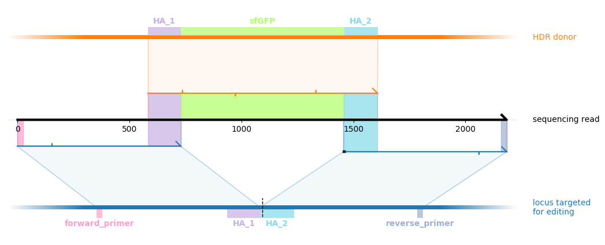
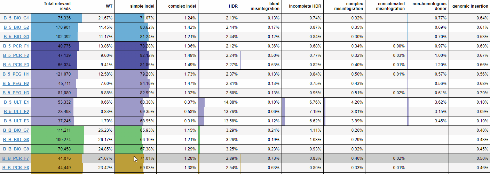

# knock-knock 

`knock-knock` is a tool for exploring, categorizing, and quantifying the sequence outcomes produced by CRISPR knock-in experiments.


## Installation  [](https://badge.fury.io/py/knock-knock) [](http://bioconda.github.io/recipes/knock-knock/README.html)

### conda
```
conda config --add channels bioconda
conda config --add channels conda-forge
conda install knock-knock
```
### pip
```
pip install knock-knock
```

If installing with `pip`, non-Python dependencies need to be installed separately:
- `blastn` (2.7.1)
- `minimap2` (2.16)
- `samtools` (1.9)
- `STAR` (2.7.1)


## About

`knock-knock` tries to identify the different ways that genome editing experiments can produce unintended shufflings and rearrangments of the intended editing outcome.
In order to do this, the strategy used to align sequencing reads makes as few assumptions as possible about how the reads should look.
Instead, it takes each amplicon sequencing read and attempts to produce a comprehensive set of local alignments between portions of the read and all relevant sequences present in the edited cell.
Each read is then categorized by identifying a parsimonious subset of local alignments that cover the whole read and analyzing the architecture of this set of covering alignments. 

`knock-knock` supports Pacbio CCS data for longer (\~thousands of nts) amplicons and paired-end Illumina data for shorter (\~hundreds of nts) amplicons.

## Visualization
`knock-knock` provides a few ways to interactively explore the different types of alignment architectures produced by each experiment. Click [here](docs/visualization.md) for a guided tour, or [here](https://jeffhussmann.github.io/knock-knock_demo/) for a small live demo.

### Summary table


### Outcome-stratified amplicon length distributions


## Getting started

This tutorial will walk you through the process of using knock-knock to analyze amplicon sequencing data of an editing experiment, broken down into six steps:
1. [Setting up a project directory](#Setting-up-a-project-directory)
1. [Obtain reference genomes and build alignment indices from them](#Obtaining-reference-sequences-and-building-indices)
1. [Provide information about the genomic locii targeted for editing and HDR donor sequences](#Specifying-targets)
1. [Fill out sample sheets associating each sample with sequencing data files and an editing strategy](#Sample-sheets)
1. [Process data to generate alignments and classify outcomes](#Processing-samples)
1. [Generate summary tables and visualizations](#Generating-tables)

### Setting up a project directory

The first step in using knock-knock is to create a project directory that will hold all input data, references sequences, and analysis output for a given project.

Every time knock-knock is run, this directory is given as a command line argument to tell knock-knock which project to analyze.

Throughout this documentation, `PROJECT_DIR` will be used as a stand-in for the path to an actual project directory.

knock-knock is packaged with some small example data sets for testing purposes. To install this example data to a user-specified project directory, run 

```
knock-knock install_example_data PROJECT_DIR
```

After running this command, PROJECT_DIR will contain 

```
PROJECT_DIR
├── data
│   ├── illumina
│   │   ├── BCAP31_ultramer_R1.fastq.gz
│   │   ├── BCAP31_ultramer_R2.fastq.gz
│   │   ├── CLTA_PCR_R1.fastq.gz
│   │   ├── CLTA_PCR_R2.fastq.gz
│   │   └── sample_sheet.csv
│   └── pacbio
│       ├── RAB11A_PCR.fastq.gz
│       ├── RAB11A_plasmid.fastq.gz
│       └── sample_sheet.csv
└── targets
    ├── amplicon_primers.csv
    ├── donors.csv
    ├── sgRNAs.csv
    └── targets.csv
```

### Obtaining reference sequences and building indices

Once you have created a project directory, `knock-knock` needs to be provided with the reference genome of a targeted organism in fasta format in order to build indices from this reference.
These files are stored in directory called `indices` inside a project directory.

knock-knock provides a built-in way to download references and build indices for human (hg38), mouse (mm10), or e. coli genomes. To do this, run

```knock-knock build-indices PROJECT_DIR ORGANISM [--num-threads NUM_THREADS]```

where ORGANISM is one of hg38, mm10, or e_coli, and NUM_THREADS is an optional argument that can be provided to use multiple threads for index building.
(This can take up to several hours for mammalian-scale genomes.)

Running this command for hg38 will populate `PROJECT_DIR/indices/hg38` with the following files: 

```
PROJECT_DIR/indices/hg38/
├── STAR
│   ├── Genome
│   ├── SA
│   ├── SAindex
│   ├── chrLength.txt
│   ├── chrName.txt
│   ├── chrNameLength.txt
│   ├── chrStart.txt
│   └── genomeParameters.txt
├── fasta
│   ├── hg38.fa
│   └── hg38.fa.fai
└── minimap2
    └── hg38.mmi
```

Alternatively, if reference genomes and indices already exist (e.g. in another projects directory), a YAML file `PROJECT_DIR/index_locations.yaml` that lists paths can be provided. 

### Specifying targets

The next step is to provide information about which genomic location was targeted for editing and the sequence of the donor that was provided (if any).
`knock-knock` refers to the combination of a genomic location and associated homology donor as a *target*.
Information about targets is stored in a directory called `targets` inside a project directory.

Genomic location is specified by providing the name of genome targeted (which must exist in PROJECT_DIR/indices), the protospacer of the (SpCas9) sgRNA that was used for cutting, and the amplicon primers flanking the genomic location of this protospacer that were used to amplify the genomic DNA. 

Targets are defined in a set of csv files inside the `targets` directory. A group of "parts-list" files `sgRNAs.csv`, `amplicon_primers.csv`, `donors.csv`, and `extra_sequences.csv` are used to register named sequences of each csv's corresponding type, and a master csv file `PROJECT_DIR/targets/targets.csv` defines each target using references to these named sequences.

A target is defined by filling out a row in `PROJECT_DIR/targets/targets.csv`, which must have the following columns:

- `name`: a short, descriptive name for the target
- `genome`: the name of the genome targeted (which must exist in `PROJECT_DIR/indices`)
- `sgRNA_sequence`: name of the protospacer sequence that was cut. knock-knock can analyze data produces by cutting with multiple nearby guides in no-donor mode. If there are multiple guides, include all sgRNA names joined by semicolons.
- `amplicon_primers`: name of the primer pair used to generate the amplicon for sequencing
- `donor_sequence`: name of the homology-arm-containing donor, if any
- `nonhomologous_donor_sequence`: name of the non-homology-arm containing donor, if any
- `extra_sequences`: name(s) of any extra sequences that may be present, joined by semicolons.

As an example, the contents of the `targets.csv` file included with knock-knock's example data are:
```
name,genome,sgRNA_sequence,donor_sequence,amplicon_primers,nonhomologous_donor_sequence,extra_sequences
BCAP31_GFP11_U_ILL,hg38,BCAP31,BCAP31_GFP11_U,BCAP31_ILL,,
CLTA_GFP11_PCR_ILL,hg38,CLTA,CLTA_GFP11_PCR,CLTA_ILL,,
RAB11A_150nt_plasmid,hg38,RAB11A,pML217_RAB11A-150HA,RAB11A_PAC,,
RAB11A_150nt_PCR,hg38,RAB11A,RAB11A-150HA_PCR_donor,RAB11A_PAC,,
```

Further details:

The `sgRNA_sequence` column of `targets.csv` should reference entries in `sgRNAs.csv`.
Each row of `sgRNAs.csv` defines a single named sgRNA sequence, with columns `name` and `sgRNA_sequence`.
sgRNA sequences should be given as 5' to 3' sequence and not include the PAM.
They must exactly match a sequence in the targeted genome.

As an example, the contents of the `sgRNAs.csv` file included with knock-knock's example data are:
```
name,sgRNA_sequence
BCAP31,GATGGTCCCATGGACAAGA
CLTA,GAACGGATCCAGCTCAGCCA
RAB11A,GGTAGTCGTACTCGTCGTCG
```

The `amplicon_primers` column of `targets.csv` should reference entries in `amplicon_primers.csv`.
Each row of `amplicon_primers.csv` defines a named amplicon primer pair, with columns `name` and `primer_sequences`.
Primer sequences should be given as the 5' to 3' sequences of the primer pair (i.e. the two sequences should be on opposite strands) joined by a semicolon.
If a primer pair is used together with an sgRNA, there must exist exact matches to the two primer sequences on opposite sides of the sgRNA sequence somewhere in the targeted genome.

As an example, the contents of the `amplicon_primers.csv` file included with knock-knock's example data are:

```
name,amplicon_primer_sequences
BCAP31_ILL,GCTGTTGTTAGGAGAGAGGGG;GGGAAGCAGAAGGGCACAAA
CLTA_ILL,ACCGGATACACGGGTAGGG;AGCCGGGTCTTCTTCGC
RAB11A_PAC,GCAGTGAAGAAGCTCATTAAGACAAC;GAAGGTAGAGAGAGTTGCCAAATGG
```

The `donor_sequence` and `nonhomologous_donor_sequence` columns of `targets.csv` should reference entries in `donors.csv`.
Rows of `donors.csv` define named donors, with columns `name`, `donor_type`, and `donor_sequence`.
If a donor is used in the `donor` column of a target definition, its sequence must contain two homology arms that flank the cut site of target's sgRNA. 
Setting `donor_type` to `plasmid` causes knock-knock to be aware that the sequence has a circular topology when processing alignments to it.


As an example, the contents of the `donors.csv` file included with knock-knock's example data are:
```
name,donor_type,donor_sequence
BCAP31_GFP11_U,ssDNA,CTACTGCTGTGGGATTTCTGTCCCTTTCCAGGCTG...
CLTA_GFP11_PCR,PCR,GGGAACCTCTTCTGTAACTCCTTAGCGTCGGTTGGTT...
pML217_RAB11A-150HA,plasmid,agcccgaccgctgcgccttatccggtaa...
RAB11A-150HA_PCR_donor,PCR,GCCGGAAATGGCGCAGCGGCAGGGAGGGG...
```

where the actual donor sequences have been truncated for display purposes.


After filling out all target-specification csvs, run 
```
knock-knock build_targets PROJECT_DIR
```
to convert the information you have provided into the form needed for subsequent analysis.

### Sample sheets

Input sequencing data fastq files should be stored in a directory called `data` inside the project directory, with each group of experiments (typically from one sequencing run) stored in a further subdirectory (e.g. `PROJECT_DIR/data/EXAMPLE_GROUP`).

Each group subdirectory needs a sample sheet to tell knock-knock which target to align each experiment to.
Samples are defined by rows in `sample_sheet.csv`.
Every sample sheet should contain the columns:
- `sample`: a short, descriptive name of the sample
- `platform`: `illumina` or `pacbio`
- `target_info`: the name of the target (which must have been built as described [above](#specifying-targets))
- `supplemental_indices`: the name(s) of full genomes to which reads should be aligned, joined by semicolons. This should typically be the name of the targeted organism, plus e_coli if a plasmid donor produced in e. coli was used. Genome names referenced must exist in `PROJECT_DIR/indices` as described [above](#obtaining-reference-sequences-and-building-indices).
- `color`: an optional color to associate with this sample in visualizations. Can be an integer or any string format that matplotlib recognizes (see [here](https://matplotlib.org/3.1.0/tutorials/colors/colors.html)).

The columns used to specify which fastq files belong to each sample are different for Illumina and Pacbio sequencing runs.
In both cases, all fastq files must be located in `PROJECT_DIR/data/EXAMPLE_GROUP/` and should be given with these leading directory components removed (i.e. as would be returned by `basename`). Fastq files can be gzipped. 
 
Illumina sample sheets should contain columns `R1` and `R2`, which should specify R1 and R2 file names for each sample. 

Pacbio sample sheets should contain column `CCS_fastq_fn`, which should specify a circular consensus sequence fastq file name for each sample. 

As examples, the contents of `data/illumina/sample_sheet.csv` in knock-knock's example data are:
```
sample,platform,R1,R2,target_info,supplemental_indices,color
B_ULT,illumina,BCAP31_ultramer_R1.fastq.gz,BCAP31_ultramer_R2.fastq.gz,BCAP31_GFP11_U_ILL,hg38,1
C_PCR,illumina,CLTA_PCR_R1.fastq.gz,CLTA_PCR_R2.fastq.gz,CLTA_GFP11_PCR_ILL,hg38,2
```

and the contents of `data/pacbio/sample_sheet.csv` are:
```
sample,platform,CCS_fastq_fn,target_info,supplemental_indices,max_relevant_length,color
R_plasmid,pacbio,RAB11A_plasmid.fastq.gz,RAB11A_150nt_plasmid,hg38;e_coli,6000,1
R_PCR,pacbio,RAB11A_PCR.fastq.gz,RAB11A_150nt_PCR,hg38;e_coli,6000,2
```

### Processing samples

Once all relevant targets have been built and sample sheets filled out, process sequencing data from a single sample by running 

```
knock-knock process PROJECT_DIR EXAMPLE_GROUP EXAMPLE_SAMPLE
```

To process multiple samples in parallel, run

```
knock-knock parallel PROJECT_DIR MAX_PROCS
```

which will process all samples in all groups in PROJECT_DIR up to MAX_PROCS at a time. To process only samples from a single group,
run 

```
knock-knock parallel PROJECT_DIR MAX_PROCS --group EXAMPLE_GROUP
```

### Generating tables

After experiments have been processed, generate tables summarizing the frequencies of different read architectures in each sample by running

```
knock-knock table BASE_DIR
```

which will create `PROJECT_DIR/results/EXAMPLE_GROUP.html`. See [here](docs/visualization.md#Tables) for an explanation of these tables.
